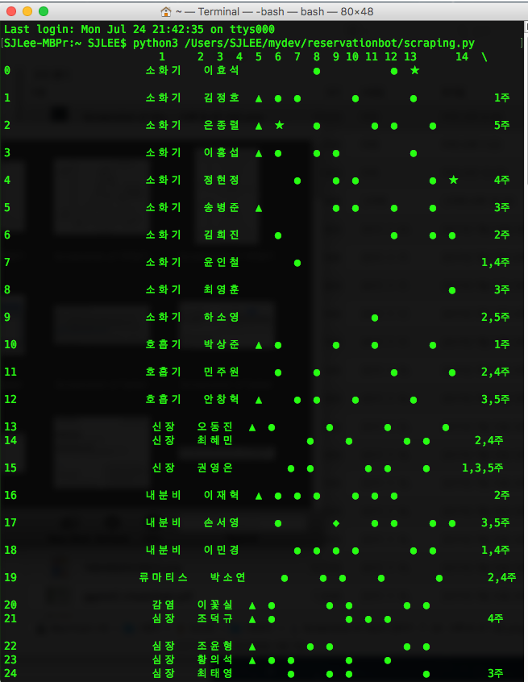

웹페이지에 아래와 같은 내용으로 진료시간표가 저장되어 있다. 이걸 python 으로 web scraping 하여 재사용할 수 있는 데이터 구조로 저장해보자.


필요한 라이브러리를 불러오자.
1. 일단 웹 스크래핑에 필요한 `BeautifulSoup` 
2. http에서 불러들이기 위해 `urlopen`
3. 나중에 `pandas`를 이용하여 dataframe 구성
4. 왠지 빠지면 안될 것 같은 `numpy`까지

```python
from bs4 import BeautifulSoup
from urllib.request import urlopen
import pandas as pd
import numpy as np
from pandas import DataFrame, Series
```

첫번째 할일은 해당 주소에서 html을 읽어들이는 것. 이걸 source라는 변수에 저장하자.

lxml은 ‘보기 좋게’ 읽어들이는 기능이다.

```python
html = urlopen('http://www.mjh.or.kr/index.php?mid=page_wOcF10')
source = html.read()
html.close()
soup = BeautifulSoup(source, "lxml")
```

BeautifulSoup 은 찾고자 하는 내용이 속한 tag를 지정해주면 내용을 불러온다. 찾고자 하는 내용은 `timetablePerDoctor` 라는 `class`로 지정되어 있는 `tr` tag 안에 있다. 저 한줄마다 각각 의사의 진료일정 정보가 담겨있다.


다음은 beautifulsoup을 이용하는 기본 개념이다.

```python
list_per_doctors = soup.find_all('tr', {'class': 'timetablePerDoctor'})
```

이것은 `timetablePerDoctor라는 클래스로 지정된 tr을 모두 찾아라` 라는 뜻이다. find_all 로 찾으면 결과가 여러개일 것이므로 결과값은 배열로 저장되고 find로 찾으면 개별 변수로 저장된다.
만약 `print(list_per_doctors)` 를 한다면
`: [ 결과1, 결과2, 결과3, ... ]`
이렇게 저장되어 보여질 것이다.
각각의 결과n 은 <tr> 태그와 </tr> 태그 안에 있는 내용이 되겠다. 


위의 두번째줄부터 하나의 결과인데, \<tr\>…\<td\>…\</td\>…\</tr\> 이라는 구조로 되어있다.

그리고 td 로 구성된 한 줄마다 필요한 내용이 들어있다. 첫줄은 이름, 둘째줄은 선택진료여부, 그 다음은 요일별 진료 여부…

그래서 아래와 같은 구조로 만들어야 한다.

for 각각의 의사 in 의사별 목록:

 읽어오기(한명의 의사)

 for 각각의 정보 in 한명의 의사:

 읽어오기(각각 셀의 정보)

```python
list = [None] * len(list_per_doctors)
for n in range(len(list_per_doctors)):
    list[n] = [None] * 15
    list_td = list_per_doctors[n].find_all('td')
    dept = list_per_doctors[n].find_all('td', {'class': 'oddTdss'})
    if dept:
        list[n][0] = dept[0].text
        for item in range(1,len(list_td)):
            list[n][item] = list_td[item].text
    else:
        list[n][0] = list[n-1][0]
        for item in range(0,len(list_td)):
            list[n][item+1] = list_td[item].text
```

실제 코딩에는 if…else가 들어가 있는데 그 이유는, 각 과의 첫번째 의사에게만 소속 과 정보가 들어있기 때문이다. 소속 과 정보가 없다면 위의 의사에게 있던 소속과 정보를 끌어와서 해결했다.

여기까지 과정에서 배열을 자세히 고민하지 않으면 무수한 에러를 만나게 된다.

[ [ 1, 2, 3 ], [ 4, 5, 6 ], [ 7, 8, 9 ] ]

위는 아래와 같은데 아래처럼 배열되어야 우리가 이해할 수 있다.

[

[ 1, 2, 3 ],

[ 4, 5, 6 ],

[ 7, 8, 9 ]

]

```python
index_number = ['1','2','3','4','5','6','7','8',
    '9','10','11','12','13','14','15']
df = Dat
aFrame(np.array(list), columns=pd.Index(index_number))
print(df)

```

numpy에 배열로 집어넣자. index를 정해주면 excel 표처럼 표현해준다.



```python
index_list=['Department', 'Doctor', 'Selective', 'Mon_AM', 'Mon_PM',
    'Tue_AM', 'Tue_PM', 'Wed_AM', 'Wed_PM', 'Thu_AM', 'Thu_PM',
    'Fri_AM', 'Fri_PM', 'Sat_AM', 'Specialty' ]
df = DataFrame(np.array(list), columns=pd.Index(index_list))
df.to_csv('output.csv', encoding='utf-8')
```

나중에 사용하려고 pandas의 DataFrame으로 저장했다. pandas로 표를 조작하면 편리하기 때문이다.

활용은 나중에 하고 일단 csv로 저장하자. excel로 불러오면 왠지 한글은 깨졌지만 저장은 잘 되있다. cp949로 저장해야되나? 

결론적으로,

실은… 웹페이지에서 바로 드래그 해서 엑셀에 복붙해도 비슷하게 된다. merged cell에서 조금 에러는 나겠지만….